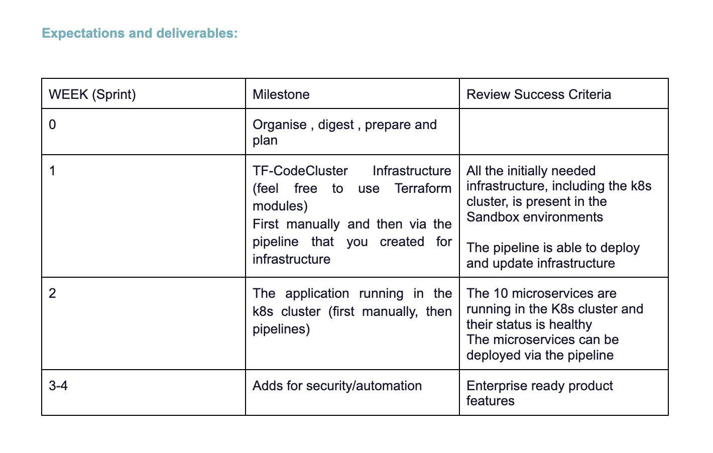
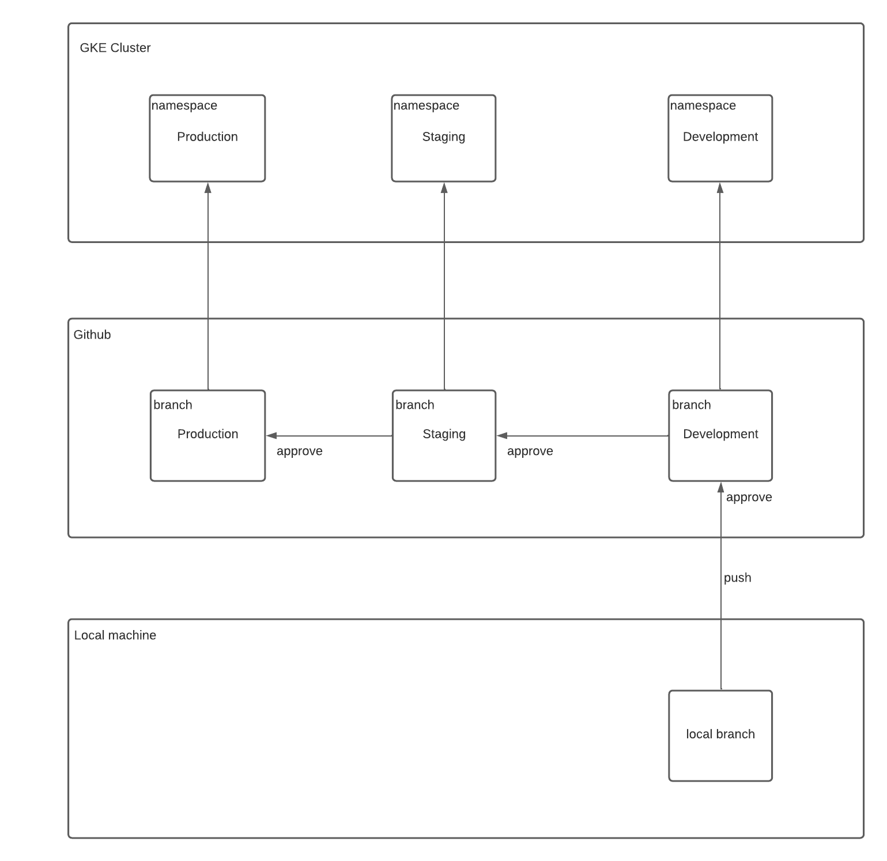
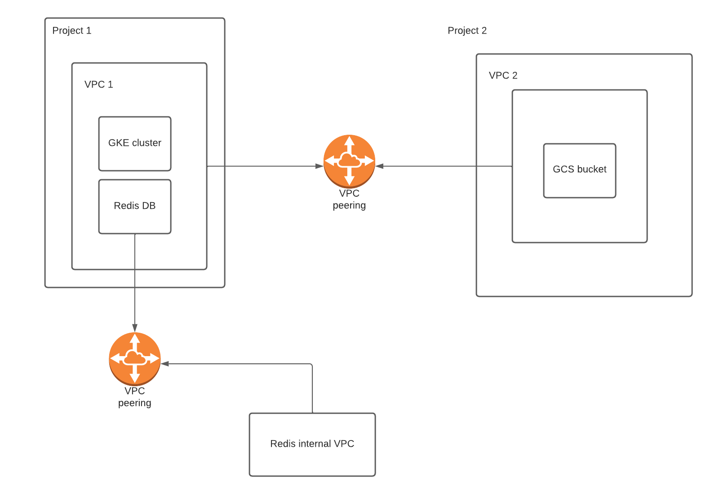

# Goal 
Implement GCP’s microservice sample app into a real scenario, working with network setups and a full CICD implementation with strong focus on security.
The aim is to get exposed to as many architecture, security and implementation best practices, while having fun :)

# Requirements 

- IaC ( including Pull requests workflows)
- Fully automated CI/CD and release management.
- Easy to use development environment
- Highly secure production environment
- Organisation governance with least privilege and zero trust policy. 

# Mandatory Technologies

- Shared VPC implementation
- VPN to a second project (simulating on-prem env) 
- Service account  and workload identity 
- Release management for the services
- GKE ( private cluster )
- Ingress 
- DNS
- SSL certificates
- Private redis connection ( private service networking)

---

# Sprint Plan

---

# CI/CD Workflow

---

# VPC Peering Architecture Diagram

---

# Sprint 1 accomplishment

- Deploy infrastructure to official projects (team2-A and team2-B) via terraform and automate with github

- Implement two different VPC's via terraform, and implement VPC peering

- Testing network connectivity between two VPCs

- Separate k8s namespaces for different Environments via terraform - Development Env - Production Env - Staging Env

- Implement K8s cluster in VPC 1 via terraform

- Connect Redis IP to cart service configuration of cluster in VPC 1

---

# Sprint 2 accomplishment

- Private k8s Cluster created with terraform and automated with pipeline

- Microservice pipelines created and services deployed with pipeline and skaffold

- Microservices deployed to specific namespaces